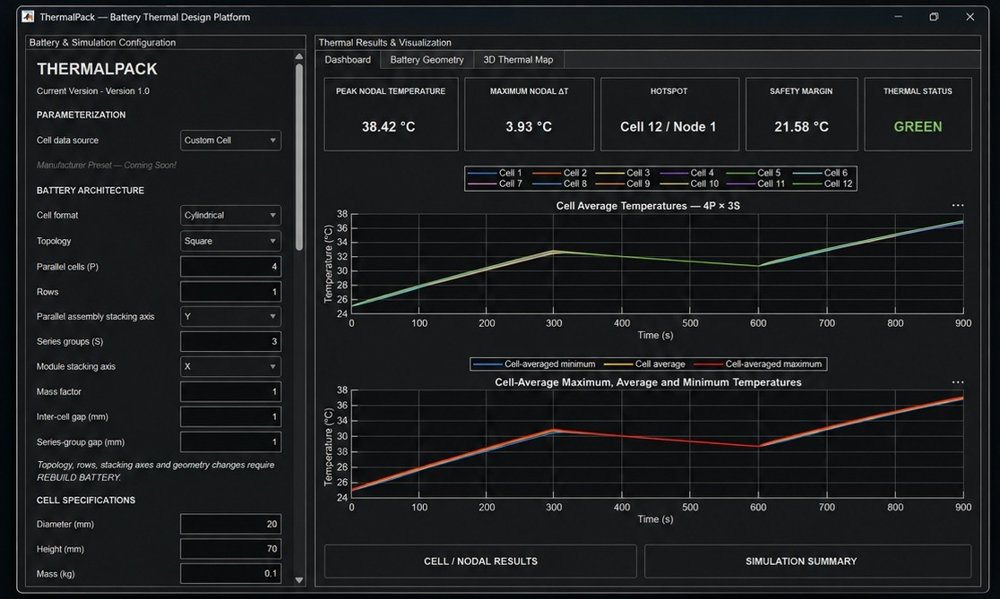
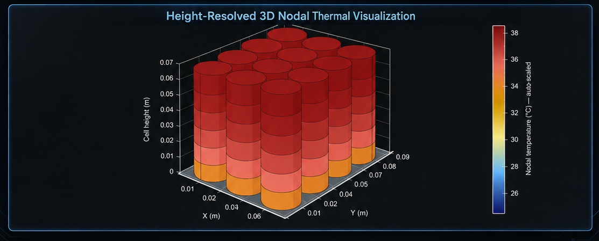

# ThermalPack

**Battery Thermal Design & Simulation Platform — Version 1.0**

ThermalPack is a physics-based reduced-order battery thermal modelling platform developed in **MATLAB, Simulink, Simscape Battery, and Simscape Thermal Liquid**.



The project aims to provide a faster engineering workflow for investigating battery temperatures, thermal gradients, hotspots, and cooling-system performance without relying on high-fidelity CFD for every design iteration.

ThermalPack is currently under active development. Version 1.0 represents the current functional release of the platform.

---

## Current Capabilities

ThermalPack Version 1.0 currently supports:

* Configurable cylindrical battery module architecture
* User-defined cell geometry and electrical/thermal properties
* Dynamic charge, rest, and discharge current profiles
* Height-distributed thermal modelling with multiple axial thermal nodes per cell
* Liquid cooling using a bottom cooling plate
* Coolant flow rate, inlet temperature, and ambient boundary-condition control
* Inter-cell and cell-to-ambient heat-transfer modelling
* Cell-average and nodal temperature analysis
* Hotspot identification by cell and thermal node
* Peak nodal temperature and temperature-spread KPIs
* Thermal safety-margin and status evaluation
* 3D battery geometry visualization
* Time-resolved 3D nodal thermal visualization

---

## Model Architecture

ThermalPack uses a non-destructive model architecture.

`Thermal_Model_v3.slx` acts as the **master physics model**.

When the application is launched, ThermalPack creates a local working model:

```text
Thermal_Model_v3_UI.slx
```

The working model is used for battery rebuilding, parameter changes, and simulations while the original master model remains unchanged.

Battery modules are created programmatically using the Simscape Battery Builder architecture.

The current Version 1.0 baseline uses a cylindrical battery module with height-distributed thermal modelling and liquid cooling through a bottom cooling plate.

---

## Main Application

The main MATLAB application is:

```text
ThermalPackApp_v1_App.m
```

The application provides controls for:

* Battery architecture
* Cell geometry
* Electrical cell data
* Thermal properties
* Cell-to-cell variations
* Current load profiles
* Cooling configuration
* Coolant properties
* Flow-source settings
* Reservoir conditions
* Simulation settings
* Thermal results and visualization

---

## Software Requirements

ThermalPack requires MATLAB with the relevant modelling products installed.

The project has been developed using:

* MATLAB
* Simulink
* Simscape
* Simscape Battery
* Simscape Fluids / Thermal Liquid

Compatibility with other MATLAB releases has not yet been fully evaluated.

---

## Running ThermalPack

Clone or download the repository and open the project folder in MATLAB.

Ensure the following files are available in the MATLAB working directory:

```text
ThermalPackApp_v1_App.m
Thermal_Model_v3.slx
```

Run:

```matlab
ThermalPackApp_v1_App
```

ThermalPack will create the local simulation working model automatically:

```text
Thermal_Model_v3_UI.slx
```

The working model is intentionally excluded from version control.

---

## Typical Workflow

```text
Configure Battery
      ↓
Configure Cell Properties
      ↓
Define Load Profile
      ↓
Configure Cooling & Boundary Conditions
      ↓
Rebuild Battery
      ↓
Run Simulation
      ↓
Analyse Thermal KPIs
      ↓
Inspect Cell / Nodal Results
      ↓
Visualize 3D Thermal Distribution
```

---

## Thermal Results

The Version 1.0 dashboard provides:

**Peak Nodal Temperature**

Maximum temperature reached by any thermal node during the simulation.

**Maximum Nodal ΔT**

Maximum temperature spread across the nodal battery model.

**Hotspot**

Identification of the hottest cell and thermal node.

**Safety Margin**

Temperature margin relative to the defined thermal limit.

**Thermal Status**

Temperature-threshold-based GREEN / YELLOW / RED classification.

ThermalPack also provides cell-average temperature histories and detailed nodal temperature data.

---

## 3D Nodal Thermal Visualization

Each cylindrical cell can be divided into multiple thermal segments along its height.



The 3D thermal map displays the calculated nodal temperatures directly on the battery geometry and allows the user to move through the simulation using a time slider or playback controls.

This provides spatial information about temperature gradients and hotspot development while retaining the computational efficiency of a reduced-order model.

---

## Current Limitations

Version 1.0 currently focuses on cylindrical cells and a bottom liquid-cooling configuration.

The model should currently be treated as a developing engineering and research platform rather than a fully validated predictive battery digital twin.

The current safety status is based on defined temperature thresholds and does **not** represent a thermal-runaway prediction model.

---

## Development Roadmap

### Version 2.0

Planned development includes:

* Cylindrical, pouch, and prismatic cell configurations
* Automated parameter sweeps
* Cooling-system optimization
* Expanded cooling architectures
* Advanced cooling-plate configurations

### Version 3.0

Longer-term development includes:

* Validation against experimental and/or CFD results
* More detailed pack-level thermal and hotspot analysis
* Advanced battery safety and thermal-runaway modelling
* Machine-learning-assisted acceleration of large thermal design studies

---

## Project Status

**Current release:** Version 1.0

**Development status:** Active

ThermalPack is an independent engineering and research project and will continue to evolve as additional modelling, optimization, and validation capabilities are developed.

---

## Author

**Talha Ahmad**

Mechanical & Automotive Engineer

M.Sc. Automotive Engineering, RWTH Aachen University

Battery Thermal Management · CFD · Reduced-Order Modelling · MATLAB/Simulink · Multiphysics Simulation
